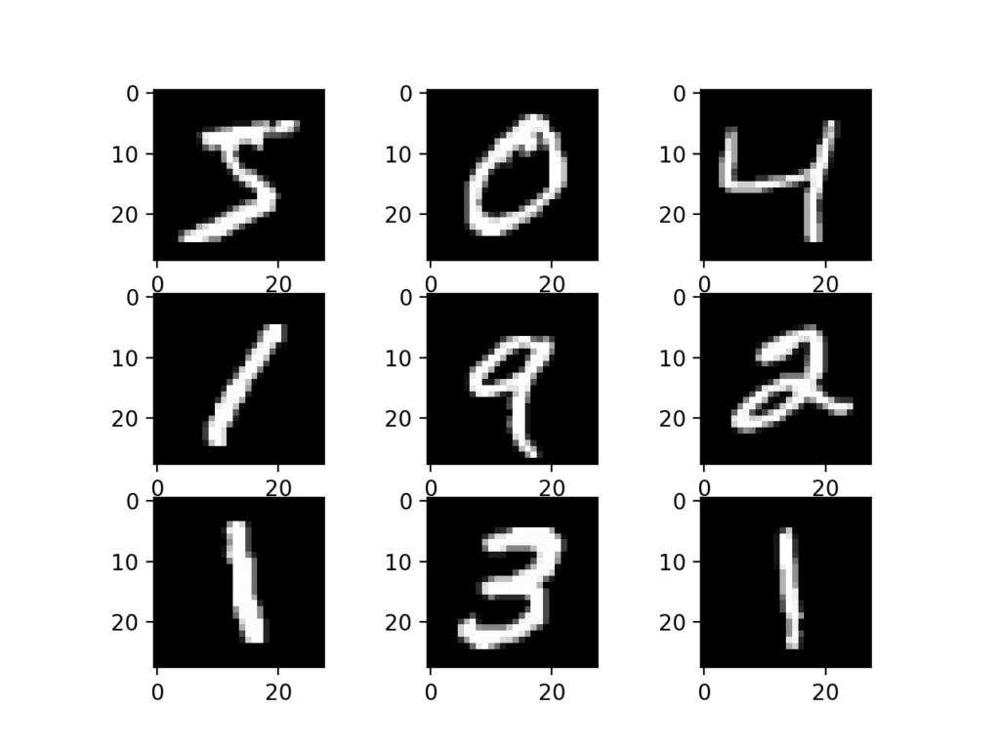

# TTT4275-Classifier :bowtie:
Project Spring 2023

1. Classifying Iris species 

[Tasks](digits.pdf)


2. Classifying numbers

[Tasks](iris.pdf)



## Report
to be published

# Requirements
 
```python
    pip install -r requirements.txt
```

## Questions for The teaching staff
* Is it fine getting the data for the MNist from keras and tensorflow (online)
* is a visualization (plot MSE vs iterations for different alphas) for choosing the step-length necesarry
* 